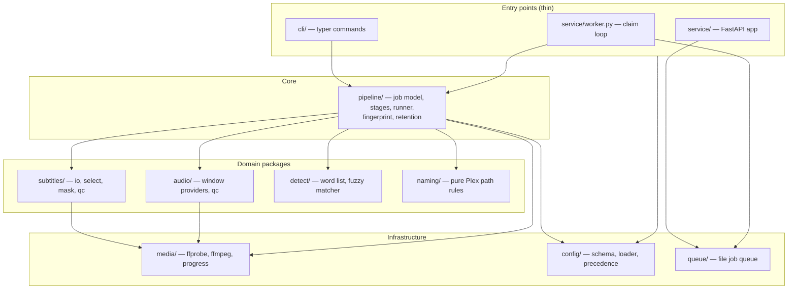
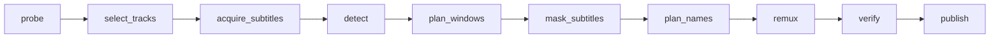

# Censorr v2 — Detailed Design

**Status**: Revision 2 (post adversarial review #1) · 2026-07-16
**Location of build**: git worktree `~/Code/censorr-rewrite`, branch `rewrite/v2`

## 1. Overview

Censorr v2 is a ground-up rewrite of a media-censoring tool for the Plex/Sonarr/Radarr ecosystem. It takes a movie or TV episode file, finds profanity via the file's subtitles, produces a **new, clean copy** — profane audio muted, subtitles masked — named and placed so Plex resolves it correctly, and leaves the original untouched. It runs two ways: a direct CLI, and a small service (API + worker) that Sonarr/Radarr call natively via webhooks whenever they import media.

Design priorities, in order:
1. **Correct censoring** — under-muting is never acceptable; every mute window fully covers the profanity with buffer on both sides, and the output is verified before it's published.
2. **Plex-correct outputs** — naming/placement rules live in one pure module and are treated as a contract.
3. **Human-readable code** — domain-based packages, small files, obvious names, no clever indirection.
4. **Minimal inputs** — `censorr process movie.mkv` works with zero configuration; config exists only to customize.

## 2. Detailed Requirements

Consolidated from idea-honing Q1–Q17 (later decisions override earlier ones; this document reflects final state).

### Functional

- **R1 — Core censoring**: Detect profanity in a media file's **text** subtitles using fuzzy matching against a word list (bundled default; user-overridable). Word-list schema: `{"words": [{"word", "threshold"?, "replacement"?, "aggressive"?}], "allowlist": ["..."]}` — the allowlist suppresses false positives ("damage" vs "damn"); a user allowlist *extends* the bundled one. Produce a clean copy with (a) audio muted over every detected window and (b) subtitles masked (asterisks preserving first letter, or the word's `replacement` when provided). Matching runs on the entry's plaintext (ASS override tags stripped); masks are re-injected so styling survives.
- **R2 — Mute coverage guarantee**: Every mute window = full subtitle-entry span + configurable buffer on each side (default 0.2 s, never smaller). Single-word/single-line strong-profanity entries are the critical case. Over-muting a window is acceptable; under-muting is not. Audio QC verifies silence across the entire buffered window. *Stated assumption*: this guarantee is only as strong as subtitle↔audio sync; the pipeline warns when the subtitle track's last-cue time diverges from container duration beyond a threshold, and the post-MVP alignment provider (R15) is the real fix.
- **R3 — Clean-only output**: Default output is a new MKV containing: original video (stream-copied); muted audio as the *only* audio track (correct language tag, `default` disposition, title "English (Censored)"); and **embedded subtitles only** (sidecars opt-in, R6): (a) the full masked subtitle track (language-tagged, title "English (Censored)"), and (b) a **mute-captions track** (always SRT) containing only the masked entries, flagged `forced`+`default`, so players auto-display the masked caption during muted spans with zero viewer interaction. The captions track is **omitted when it would be empty**. Original file untouched. Chapters/global metadata preserved. The output also carries `CENSORR_FINGERPRINT` global metadata (R10).
- **R4 — Plex naming (movies)**: `Title (Year) {edition-Censorr}.mkv` in the source folder, edition tag inserted after the `(Year)` token (before quality tokens). If the filename has **no** `(Year)` token, the tag is appended before the extension. If the source **already carries an edition tag**, combine: `{edition-Director's Cut}` → `{edition-Director's Cut Censorr}` (Plex allows one edition tag; combining preserves both facts). **Hard invariant, enforced in `plan_names` and golden-tested: planned output path ≠ source path, else `JobValidationError`** — non-destructiveness is structural, not situational. Folder-level edition tagging is explicitly rejected: the clean copy shares the original's folder. Sidecar (only when enabled, R6): `Title (Year) {edition-Censorr}.en.censorr.srt`.
- **R5 — Plex naming (episodes)**: mirrored structure under a configurable **clean root**; filename unchanged. When `tv_clean_root` is unset, derive it: walk up from the file until a directory matches `Season \d+|Specials` (case-insensitive) → its parent is the show dir → the show dir's parent is the library root → clean root = `<root>-clean`. No season-like dir: show dir = file's parent, root = its parent. Source path too shallow for any rule (< 3 components): `JobValidationError` instructing the user to set `tv_clean_root`. All cases in the naming golden table. Sidecar (only when enabled): same stem + `.<lang>.censorr.srt` beside the episode.
- **R6 — Sidecar convention (opt-in)**: sidecars **off by default** (`naming.write_sidecar = false`) — embedded delivery is primary (a sidecar duplicates the player's subtitle entry and is the fragile path). When enabled: `<video_stem>.<lang>.censorr.<ext>`; token config-driven (`""` → pure Plex-spec naming); `forced`/`sdh` flags in Plex's positions when the source track had them; content = the full masked subtitle.
- **R7 — CLI**: `process <file>` (single file), `reprocess <root>` (bulk walk; skips Censorr outputs — any file whose MKV metadata carries `CENSORR_FINGERPRINT` or whose name contains the configured edition tag — and Plex extras: `Trailers/`, `Behind The Scenes/`, `Featurettes/`, `*-sample.*`), `reconcile <clean_root>` (delete clean outputs whose source no longer exists — heals rename/delete drift), `inspect <file>` (probe + selection + windows + names; writes nothing outside the workdir), `serve`, `work`, `version`. `--mute-windows <json>` on `process` feeds `ExternalFileProvider`. Zero-input contract: bare `process <file>` works.
- **R8 — Service**: FastAPI app accepting **native** Sonarr/Radarr webhook payloads (`/webhook/sonarr`, `/webhook/radarr`), handling `Test`, ignoring non-`Download` events; generic `POST /jobs`; `GET /jobs/{id}` with progress; health/status endpoints. Preset precedence: query param > Arr tag mapping > media-type default. The API validates **path-prefix mapping only** (pure string logic — it has no media mounts); file existence is the worker's check. Shared secret, when configured, is accepted via `?token=` query param (native-Arr-compatible) or `X-Webhook-Secret` header.
- **R9 — Queue/worker**: file-based queue (atomic renames, leases, bounded retries, crash recovery) on a shared volume; one container image, role by command; worker calls the pipeline as a library. **Same-source dedup**: enqueueing replaces any still-queued (unclaimed) job for the same resolved source path. **Lease renewal**: the worker's progress callback touches the job lease, so long re-encodes aren't reclaimed by a second worker. **Source stability**: the worker re-stats the source before `publish`; if size/mtime changed mid-job (Arr upgrade landed), fail as `TransientError` — the retry sees the new file.
- **R10 — Idempotency**: fingerprint = hash(source size + mtime + resolved settings + word-list content hash + app version) — `source_path` deliberately excluded so host-vs-container path views agree. **The output file is the idempotency store**: the fingerprint is embedded as `CENSORR_FINGERPRINT` global MKV metadata at remux. Skip-check (in the worker/CLI, cheap and pure): `plan_names` → expected output exists? → read its tag → compare. Mismatch → reprocess and replace. `--force` overrides. This also marks outputs so ingestion never re-censors them (R7). Arr upgrades naturally reprocess (source size/mtime changed) and `deletedFiles[]` paths are run through path-mapping + `plan_names` to **delete the superseded clean outputs** during `publish`.
- **R11 — Retention**: intermediates deleted on success; failed workdirs kept with TTL (default 7 days); **job records also TTL'd** (default 30 days — safe because idempotency lives in output metadata, not records); GC sweep at worker start + periodically; `--keep-intermediates` debug flag.
- **R12 — Track selection**: subtitle candidates are filtered to **text codecs** (`subrip`, `ass`, `webvtt`, `mov_text`) — bitmap tracks (PGS/VOBSUB) are never parsed and **never mapped into the clean output** (unmaskable text would leak); selection then applies language (default `en`) + title excludes (default `sdh`, `hi`, `cc`) + forced-awareness. Audio selection prefers the main track of the subtitle's language; fallback: `und`/untagged; none → language-mismatch handling (R16). If only bitmap subtitles match, fall to the subtitle-source chain (R15), then `skipped/no_text_subtitles`.
- **R13 — Codec policy**: video always stream-copied. Muted audio re-encoded to the original codec when FFmpeg encodes it well (aac/ac3/eac3≤5.1/flac/opus); otherwise EAC3 640k fallback (`audio.fallback_codec`/`fallback_bitrate`, per-preset `audio.target_codec` override) with channel preservation where possible, substitution logged loudly. In zero-match and subtitles-only modes audio is stream-copied (no re-encode).
- **R14 — Verification (QC), symmetric**: guards against under- *and* over-censoring.
  *Under*: subtitle QC re-scans masked output for residual matches; audio QC measures RMS in each buffered window vs. neighboring control audio, read directly from the output container.
  *Over-muting*: total mute ratio ≤ budget (default 5% of runtime); max merged window duration (default 15 s); matched-entry ratio sanity (warn > 20%); **control-audio integrity** measured *within the output* (sampled non-window RMS against the output's own global RMS distribution — cross-file dB comparison would false-fail lossy fallback re-encodes); output duration parity with source.
  *Over-masking*: every altered word maps to a word-list match; unmasked plaintext byte-identical to the original's; entry count/timings unchanged; masked-entry ratio budget (warn > 15%); QC report lists each masked word with score.
  Audio QC is skipped in zero-match and subtitles-only modes (nothing was muted). Per-window generosity is required (R2); file-level over-censoring is a defect. Violations → `QCError` (exit 4, no retry) unless the matching `continue_on_*` flag is set.
- **R15 — Extensibility seams**: `MuteWindowProvider` (word-level alignment later); subtitle-source chain (embedded text track → sidecar-next-to-source → **downloader, prioritized first post-MVP addition** per Q17 — subliminal behind an extra, so no-subs/bitmap-only files become processable); optional EDL/PlexAutoSkip export of computed windows.
- **R16 — Degraded modes** (all decided in Q17; every one is a visible, logged outcome — never a silent proceed):
  - **Zero matches** (clean source): TV → publish a **stream-copy remux** into the clean root (same track selection, no filter, no re-encode — the clean library stays complete); movies → complete as `skipped_clean` (no pointless 40 GB edition duplicate). Both per-preset configurable (`on_clean = "publish" | "skip"`). Captions track omitted; masked track == original text (embedded as-is); fingerprint metadata still written on published outputs.
  - **No usable text subtitles** (none, or bitmap-only after the source chain): complete as `skipped` with reason `no_text_subtitles` (exit 2, no retry — a normal library must not produce a wall of red); `fail_on_no_subtitles = true` upgrades it to `JobValidationError`.
  - **Audio language ≠ subtitle language** (anime: JP audio + EN subs): proceed in **subtitles-only mode** — mask subtitles, stream-copy audio unmuted (muting windows derived from a translation against foreign speech would be nonsense), omit the captions track, skip audio QC, record `mode: "subtitles_only"` in the job record. Disable via `subtitles.allow_language_mismatch = false` (then → `skipped/language_mismatch`).

### Non-functional

- **N1**: Python 3.12+. Core deps (5): typer, pydantic v2, rapidfuzz, pysubs2, rich. `censorr[serve]` extra (+2): fastapi, plain uvicorn. FFmpeg ≥ 6 on PATH. TOML config via stdlib `tomllib`. (Audit: research/dependency-audit.md.)
- **N2**: Structured JSON logs in service/worker (stable fields: `job_id`, `stage`, `event`); rich human output in CLI only. Progress from FFmpeg `-progress pipe:1`. Heartbeats suppressible via env for tests.
- **N3**: Never shell-interpolate: FFmpeg args as lists; filtergraphs via `-filter_complex_script` files.
- **N4**: Deterministic: same inputs + settings → byte-stable naming and window decisions.
- **N5**: Tests: pure-logic unit tests (no FFmpeg); integration on synthesized lavfi fixtures; contract tests for API/CLI. v1's fuzzy-matcher tests (incl. allowlist) ported as the matcher spec.
- **N6**: PEP 8 naming, enforced via ruff pep8-naming (`N`): lowercase packages (no underscores; module filenames may use them), CapWords classes with acronyms fully capitalized (`QCReport`), exceptions suffixed `Error` only for actual errors (non-errors are result statuses), snake_case functions, `UPPER_CASE` constants, `_leading_underscore` non-public.
- **N7**: Docker: one **Alpine-based** image (`python:3.12-alpine` + apk ffmpeg; multi-stage; no compiler — musllinux wheels verified; ≈230 MB; adversarially reviewed vs slim with flip conditions: research/base-image-decision.md). Compose runs `serve` + `work` from one image sharing a queue volume; API container mounts **no media**; worker mounts movies/tv/tv-clean and **fails loudly at startup if the clean root is missing or unwritable**. Root only in the entrypoint to chown volumes, then `su-exec` → UID 1000. `Dockerfile`, `docker/entrypoint.sh`, `docker-compose.yml`, `.env.example` exist in the worktree (compose config syntax validated; image build necessarily pends v2 source).

## 3. Architecture Overview



Dependency rule: arrows only point downward. `naming/` and `detect/` are **pure** — no filesystem writes, no subprocess. `media/` is the only package that runs FFmpeg.

### Job flow (service path)

```mermaid
sequenceDiagram
    participant Arr as Radarr/Sonarr
    participant API as censorr serve
    participant Q as file queue
    participant W as censorr work
    Arr->>API: POST /webhook/radarr (native payload)
    API->>API: parse event, map path prefixes, resolve preset
    API->>Q: enqueue (replaces any still-queued job for same source)
    API-->>Arr: 202 {status: queued, job_id}
    W->>Q: claim (atomic rename + lease; renewed on progress ticks)
    W->>W: source exists? fingerprint in expected output matches?
    alt already clean (fingerprint match)
        W->>Q: done {result: skipped}
    else process
        W->>W: run pipeline (library call); re-stat source before publish
        W->>Q: job record: progress → done/failed
    end
```

### Pipeline stages (both CLI and worker run exactly this)



| Stage | Package | Consumes → produces (fields on `PipelineContext`) |
|---|---|---|
| `probe` | media | `job.source` → `media_info: MediaInfo` |
| `select_tracks` | subtitles/audio | `media_info` → `selection: TrackSelection` (text-codec filter, language, excludes; language-mismatch → `mode="subtitles_only"`) |
| `acquire_subtitles` | subtitles | `selection` → `subtitle_doc: SubtitleDoc` (extract embedded track, else sidecar-next-to-source, else → `skipped/no_text_subtitles`) |
| `detect` | detect | `subtitle_doc` → `matches: dict[int, list[Match]]` (empty → `mode="clean"`) |
| `plan_windows` | audio | `matches`, `subtitle_doc` → `windows: list[MuteWindow]` (provider; skipped in clean/subtitles-only modes) |
| `mask_subtitles` | subtitles | `subtitle_doc`, `matches` → `masked_doc`, `captions_doc` (captions omitted if empty) |
| `plan_names` | naming | `job`, `media_type`, config → `naming_plan: NamingPlan` (pure; invariant output ≠ source) |
| `remux` | media | all above → `temp_output: Path` (single pass; copy in clean/subtitles-only modes; embeds `CENSORR_FINGERPRINT`) |
| `verify` | subtitles/audio | `temp_output` → `qc_report: QCReport` |
| `publish` | pipeline | atomic move temp → final; delete superseded outputs (upgrade `deleted_files`); write sidecar **if enabled**; write job record; cleanup |

`inspect`/`--dry-run` runs through `plan_names` and prints the remux plan; nothing is written outside the workdir.

## 4. Components and Interfaces

### Package layout

```
censorr/
├── cli/          main.py (typer app), views.py (rich presentation)
├── service/      app.py, arr_models.py, routes_webhooks.py, routes_jobs.py, worker.py
├── pipeline/     job.py, context.py, fingerprint.py, stages.py, runner.py, retention.py, errors.py
├── subtitles/    io.py, select.py, mask.py, qc.py
├── audio/        windows.py (providers), qc.py
├── detect/       wordlist.py, matcher.py
├── naming/       plex.py, models.py
├── media/        probe.py, ffmpeg.py, progress.py
├── config/       schema.py, load.py, presets.py
├── queue/        file_queue.py
└── wordlists/    default.json  (packaged data)
tests/            unit/ contract/ integration/ fixtures.py
```

### Key interfaces

```python
# pipeline/context.py — the stage contract (v1's chief bug class was untyped artifact plumbing)
class PipelineContext(BaseModel):
    job: Job; cfg: ResolvedConfig
    mode: Literal["full", "clean", "subtitles_only"] = "full"
    media_info: MediaInfo | None = None
    selection: TrackSelection | None = None
    subtitle_doc: SubtitleDoc | None = None
    matches: dict[int, list[Match]] = {}
    windows: list[MuteWindow] = []
    masked_doc: SubtitleDoc | None = None
    captions_doc: SubtitleDoc | None = None      # None when empty → track omitted
    naming_plan: NamingPlan | None = None
    temp_output: Path | None = None
    qc_report: QCReport | None = None
# Each stage: def stage(ctx: PipelineContext) -> PipelineContext (validates its inputs are set)

# naming/plex.py — PURE. The Plex contract lives here and only here.
def classify(source: Path, hint: MediaTypeHint | None) -> MediaType   # Arr hint wins over filename regex
def plan_names(source: Path, media_type: MediaType, cfg: NamingConfig) -> NamingPlan
# raises JobValidationError if planned video path == source (hard invariant)

# detect/matcher.py — port of v1 FuzzyMatcher semantics incl. allowlist (v1 tests are the spec)
class Matcher:
    def __init__(self, wordlist: WordList): ...    # WordList = words + allowlist, merged
    def find_matches(self, text: str) -> list[Match]

# audio/windows.py — the R15 seam
class MuteWindowProvider(Protocol):
    def windows(self, entries, matches, source: Path, settings: AudioSettings) -> list[MuteWindow]
class EntrySpanProvider: ...      # MVP: full entry ± buffer; merge overlaps
class ExternalFileProvider: ...   # --mute-windows JSON, merged in

# pipeline/runner.py
def run_job(job: Job, cfg: ResolvedConfig, *, on_progress: Callable[[float, str], None]) -> JobResult
# on_progress also renews the queue lease (R9); stage markers in workdir enable failed-job resume

# media/ffmpeg.py — the only subprocess site
def remux(plan: RemuxPlan, on_progress) -> Path
class RemuxPlan(BaseModel):
    source: Path; temp_output: Path
    video_stream: int; audio_stream: int; audio_mode: Literal["mute_encode", "copy"]
    audio_codec: str | None; audio_bitrate: str | None        # None when copy
    windows: list[MuteWindow]                                  # empty when copy
    masked_sub: Path | None; captions_sub: Path | None
    stream_titles: dict[str, str]; language: str
    fingerprint: str                                           # → CENSORR_FINGERPRINT metadata
# writes filtergraph to workdir/mute.filter; -filter_complex_script; parses -progress pipe:1
```

### Configuration (TOML) & precedence

Precedence resolved **once** in `config/load.py`: CLI explicit > preset > user config file > built-in defaults → frozen `ResolvedConfig` (a pydantic model mirroring the schema below, plus resolved wordlist content hash). Relative paths in the config file resolve against the config file's directory.

```toml
# censorr.toml — everything optional; an empty or absent file is valid

[detect]
# wordlist = "wordlist.json"          # override; default: bundled list
buffer_s = 0.2                        # mute buffer each side (R2)
fuzzy_threshold = 85

[subtitles]
language = "en"
exclude_titles = ["sdh", "hi", "cc"]
mute_captions = true                  # forced+default track during mutes
allow_language_mismatch = true        # false → skipped/language_mismatch (R16)

[audio]
language = ""                         # "" → follow subtitle language
fallback_codec = "eac3"
fallback_bitrate = "640k"
# target_codec = "eac3"               # per-preset explicit override (R13)

[naming]
edition_tag = "Censorr"
write_sidecar = false                 # embedded delivery is primary (R3)
sidecar_token = "censorr"             # when enabled; "" → pure Plex-spec names
# tv_clean_root = "/data/media/tv-clean"   # unset → derived per R5

[behavior]
on_clean_tv = "publish"               # zero-match: publish stream-copy | skip
on_clean_movie = "skip"
fail_on_no_subtitles = false

[qc]
audio_min_drop_db = -12.0
max_mute_ratio = 0.05
max_window_s = 15.0
warn_matched_entry_ratio = 0.20
warn_masked_entry_ratio = 0.15
continue_on_audio_qc_fail = false
continue_on_subtitle_qc_fail = false

[service]
secret = ""                           # accepted via ?token= or X-Webhook-Secret
queue_path = "/app/queue"
max_retries = 3
lease_seconds = 1800                  # renewed on every progress tick
failed_ttl_days = 7
record_ttl_days = 30
[service.path_map]
"/data/media" = "/data/media"

[presets.movies]
[presets.tv]
[arr_tag_presets]
censorr-strict = "strict"
```

### Service API

| Endpoint | Behavior |
|---|---|
| `POST /webhook/radarr?preset=&token=` | native payload; `Test`→200 ok; `Download`→prefix-map paths (string logic only — no mounts), resolve preset, dedup-enqueue → 202 `{job_id}`; unmapped prefix → 200 `{status:"ignored", reason:"unmapped_path"}`; other events → 200 ignored. Existence/fingerprint checks happen in the worker |
| `POST /webhook/sonarr?preset=&token=` | same (`episodeFile.path`; one job per file; `isUpgrade` + `deletedFiles` carried into the job) |
| `POST /jobs` | `{path, preset?, force?}` manual submission |
| `GET /jobs/{id}` · `GET /jobs?status=&limit=` | job record(s): status, mode, stage, progress, outputs, error |
| `GET /healthz` · `GET /status` | liveness · counters/version/queue depth |

Payload models: pydantic, `extra="ignore"`.

### CLI

```
censorr process <file> [--preset P] [--dry-run] [--force] [--verbose]
                       [--keep-intermediates] [--mute-windows windows.json]
censorr reprocess <root> [--preset P] [--dry-run]   # skips Censorr outputs & Plex extras (R7)
censorr reconcile <clean_root> [--dry-run]           # removes orphaned clean outputs (R7)
censorr inspect <file>
censorr serve / censorr work
censorr version
```

## 5. Data Models

```python
class MediaType(StrEnum): MOVIE, EPISODE
class Job(BaseModel):
    id: str; source: Path; preset: str | None; force: bool
    media_type_hint: MediaTypeHint | None      # from Arr payload shape
    is_upgrade: bool = False; deleted_files: list[Path] = []
    submitted_by: str                          # "webhook:radarr" | "cli" | "api"
class JobStatus(StrEnum): QUEUED, RUNNING, DONE, FAILED
class JobResult(BaseModel):
    status: Literal["ok", "skipped", "skipped_clean", "ignored"]
    reason: str | None                         # "fingerprint_match" | "no_text_subtitles" | ...
    mode: str; outputs: list[Path]
class JobRecord(BaseModel):                    # atomic JSON in queue dir; served by /jobs/{id}
    job: Job; status: JobStatus; result: JobResult | None; stage: str | None
    progress: float; fingerprint: str | None; error: JobErrorInfo | None   # data model, not an exception
    created_at: datetime; started_at: datetime | None; finished_at: datetime | None
class JobErrorInfo(BaseModel): kind: str; message: str; ffmpeg_tail: str | None
class TrackSelection(BaseModel): audio_stream: int; audio_lang: str; subtitle_stream: int | None
                                 subtitle_lang: str; subtitle_source: str; language_mismatch: bool
class SubtitleEntry(BaseModel): index: int; start_s: float; end_s: float; text: str; plaintext: str
class Match(BaseModel): word: str; span: tuple[int, int]; score: float; replacement: str | None
class MuteWindow(BaseModel): start_s: float; end_s: float; source: str; reason: str
class NamingPlan(BaseModel): video_path: Path; sidecar_paths: list[Path]  # empty unless write_sidecar
                             edition_tag_applied: str | None; track_titles: dict[str, str]
class QCReport(BaseModel):                     # symmetric (R14)
    subtitle_residuals: list[...]; audio_windows: list[WindowMeasurement]
    mute_ratio: float; max_window_s: float; matched_entry_ratio: float
    masked_entry_ratio: float; masked_words: list[MaskedWordAudit]
    control_audio_ok: bool; duration_delta_s: float
    unmasked_text_identical: bool; passed: bool; warnings: list[str]
```

Track identity flows through **typed fields only** — never path substrings.

## 6. Error Handling

Taxonomy (`pipeline/errors.py`), PEP 8-compliant (`Error` suffix on actual errors; non-errors are **result statuses**):

| | Meaning | Exit | Queue |
|---|---|---|---|
| result `ok` | processed and published | 0 | done |
| result `skipped` / `skipped_clean` / `ignored` | fingerprint match; zero-match movie; no text subs; language mismatch (when disallowed); unknown event; missing path — a `JobResult`, not an exception | 2 | done |
| `JobValidationError` | bad input/config/payload; output==source invariant; shallow path — deterministic | 3 | failed, no retry |
| `QCError` | output failed verification — deterministic | 4 | failed, no retry (workdir retained) |
| `TransientError` | I/O, FFmpeg crash, disk full, source changed mid-job | 1 | retry ≤ max_retries then failed |

All censorr exceptions derive from `CensorrError`. Publish is the **last** step — a failed job never leaves partial files in the library (temp in workdir; final move atomic rename, copy+SHA256-verify+delete across filesystems). FFmpeg stderr tail lands in `JobErrorInfo`. Service/worker logs: one JSON object per line; the CLI renders the same events via rich.

## 7. Testing Strategy

- **Unit (no FFmpeg)**: `naming/` golden table — movie/episode × edition present (combine!) / no year / clean-root derivation (season, Specials, season-less, shallow-refusal) / collision / **output≠source invariant**; matcher spec ported from v1 (`test_fuzzy_matcher.py`, `test_per_word_fuzzy.py`, `test_allowlist.py`); window buffering/merging incl. R2 single-word cases; fingerprint stability/change matrix (incl. path-independence); config precedence; queue state machine incl. dedup + lease renewal.
- **Contract**: API with captured Arr payloads (`Test`, unknown events, tag mapping, upgrade with `deletedFiles`, `?token=`); CLI exit-code table.
- **Integration (`@pytest.mark.ffmpeg`, lavfi fixtures)**: full pipeline on movie- and episode-named fixtures asserting: output naming; dispositions/titles; **no sidecar by default** and sidecar name when opted in; captions track present with `forced`+`default` (and absent when zero-match); RMS silence in buffered windows vs. audible controls; masked text; fingerprint metadata present; skip on re-run; `--force`; upgrade-replace deletes the superseded output; zero-match TV stream-copy lands in clean root; zero-match movie skips; **PGS-only fixture → skipped/no_text_subtitles**; language-mismatch fixture → subtitles-only output (audio bit-identical to source). Over-censoring guards: hostile match-everything wordlist trips the budgets; all-silent-audio simulation trips control integrity (calibrated against the eac3-fallback fixture).
- **CI**: fast job (unit+contract) + ffmpeg job. No binary fixtures in git.

TDD flow per implementation step; v1 test assertions consulted as spec before each domain module.

## 8. Appendices

### A. Technology choices

| Choice | Decision | Why (alternatives rejected) |
|---|---|---|
| Language | Python 3.12+ | v1 tests as spec; FFmpeg-glue fit (Go, TS — Q1) |
| CLI / models / matching | typer / pydantic v2 / rapidfuzz | keep from v1, audited (research/dependency-audit.md) |
| Subtitles | pysubs2 (only I/O) | v1's hand-rolled parser deleted |
| FFmpeg | thin hand-rolled adapter | ffmpeg-python (unmaintained), PyAV (overkill), ffmpy (adds nothing) |
| HTTP | FastAPI + plain uvicorn, `[serve]` extra | Litestar (ecosystem risk), granian/hypercorn (irrelevant perf/protocols), gunicorn dropped |
| Queue | hand-rolled file queue (v1 design + dedup/renewal) | Celery/RQ/Huey need brokers |
| Config | TOML via tomllib | comments + stdlib (Q11) |
| Style | ruff (lint+format, incl. `N`) + mypy + pytest | black subsumed |

### B. Key research findings (full docs in `.sop/planning/research/`)

Plex: no external audio → mute in-container; editions movie-only; sidecar parsing strict; `.censorr` token empirically fine with config escape hatch. Arr: payloads from source; `tags` are labels; `Test` mandatory; upgrades carry `deletedFiles`. FFmpeg: single-pass mute-during-remux validated; EAC3-7.1/TrueHD can't round-trip → fallback policy; `-progress` → job progress. Prior art: subtitle-driven + ASR-upgrade pattern standard; adopted replacement-words, buffer knob, source chain, EDL export (post-MVP). Alignment: forced alignment of known text per window; pure providers; `censorr[align]` glibc sidecar image. Deployment: Alpine adversarially reviewed vs slim with flip conditions.

### C. Explicitly rejected approaches

Per-op content caching (→ fingerprint, Q9); planner/registry (fixed stage list); both-audio-tracks output (Q6); worker shelling into CLI (Q5); Plex versions for TV (Q7); folder-level edition tag (original shares the folder); sidecar-by-default (Q16 — duplicate player entries, fragile path); cross-file dB control QC (false-fails lossy fallback).

### D. Review history

Adversarial review #1 (2026-07-16, subagent): 5 critical / 10 major / 4 minor findings; disposition table in `research/adversarial-review-1.md`. This revision incorporates all accepted findings and Josh's four Q17 decisions (zero-match policy, edition-tag combining, no-subs skip + downloader priority, subtitles-only language-mismatch mode).
