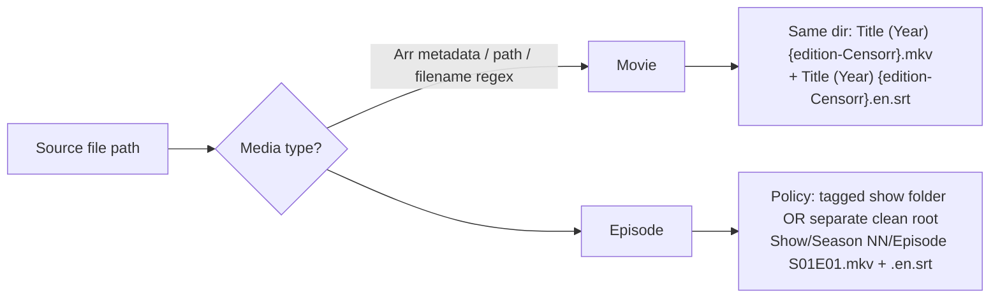

# Research: v1 Naming, Output Placement & Plex Resolution

How the current Censorr codebase names and places its outputs, and how well that aligns with Plex's actual rules. Sources: `src/utils/filename_utils.py`, `src/utils/path_builder.py`, `src/utils/final_destination.py`, `src/ops/video_remux.py`.

## What v1 does

### Media-type detection (movie vs. episode)
- Two near-duplicate implementations exist: `filename_utils.is_episode_filename()` and `path_builder.detect_media_type()` — both regex the filename for `S##E##`, `1x02`, `Season N Episode N` patterns. Anything that doesn't match is assumed to be a movie.
- **Weakness**: duplicate logic with slightly different pattern sets; no use of the folder structure or Arr-provided metadata (Sonarr/Radarr *tell you* whether it's an episode — v1 ignores that signal).

### Movie naming: edition tag
- `ensure_movie_edition_tag()` produces `Title (2024) {edition-Censorr}.mkv`, inserting the tag right after the `(year)` token, before quality tokens. Idempotent: if any `{edition-...}` tag already exists, path is returned unchanged.
- Applied only when the filename is *not* detected as an episode (`video_remux.run()` lines 168–174).
- Recent commit `046f35e` fixed sidecars to preserve the edition tag in the sidecar filename (sidecar must match the video stem exactly).

### Episode naming
- No edition tag (Plex doesn't support editions for episodes). Instead, output placement policies distinguish clean copies:
  - **`subfolder_tag`**: `TV/Show/Season 1/ep.mkv` → `TV/Show [Censorr]/Season 1/ep.mkv` (tags the show folder, assumed at `parts[-3]`).
  - **`separate_root`**: re-roots as `<separate_root>/Show/Season 1/ep.mkv`, preserving the last two path levels.
- **Weakness**: both policies hard-code positional assumptions about directory depth (`root/library/show/season/episode`); files at other depths fall into fallback branches with different behavior.

### Subtitle sidecar naming
- `build_sidecar_subtitle_path()` → `<video_stem>.<lang>.<tag>.srt` where tag ∈ {`censorr`, `clean`} (validated in Config). Example: `Movie (2024) {edition-Censorr}.en.censorr.srt`.
- Sidecar written next to the remuxed video; MD5-based collision handling reuses identical files, suffixes (`-2`) otherwise.
- **Issue**: `censorr`/`clean` are not Plex-recognized stream flags. Plex parses `.<lang>.<forced|sdh|cc>.<ext>`; an unrecognized token is treated as part of a title or ignored depending on version. See plex-naming-rules.md — the safe pattern is `Stem.en.srt` or `Stem.en.sdh.srt`. Because the *video* stem already carries `{edition-Censorr}` (movies) or lives in a censored folder (episodes), the extra `.censorr` token in the sidecar name is redundant for Plex matching and potentially harmful.

### Output modes
- `REMUX_ORIGINAL_VIDEO`: remux into workdir as `remuxed_<stem>.mkv`, then (separately) moved to replace the original. Optional `backup` flag.
- `REMUX_NEW_FILE`: movies → same folder new name with edition tag; episodes → destination policy path. Conflict policies: `reuse_if_identical` (default — but implemented as "always reuse if exists", checksum comparison is a TODO), `overwrite`, `fail`, `suffix`.
- `FinalDestinationManager` does atomic rename with copy+SHA256-verify+delete fallback for cross-filesystem moves. This part is solid and worth keeping conceptually.

### Track handling inside the container
- With `prune_non_clean_tracks` (preset default true): keep only the first muted audio track and first masked subtitle in the remux. Identification is by **path substring** (`'muted_audio' in path`, `'masked_subtitles' in path`) — recently patched to also check `metadata.muted` (commit `ed128a4`) because the substring approach broke when loading from cache.

## Plex ground truth (validated externally — see plex-naming-rules.md)

| Concern | Plex rule | v1 compliance |
|---|---|---|
| Movie editions | `Movie (Year) {edition-Name}.ext`; needs new Plex Movie agent + Plex Pass for display | ✅ compliant |
| Episode editions | Not supported → folder/library separation is the right call | ✅ concept right, fragile path math |
| Subtitle sidecars | `Stem.<lang>.<flags>.ext`, flags ∈ {forced, sdh, cc}; stem must match video exactly | ⚠️ extra `.censorr` token is non-standard |
| External audio | **Not supported** — audio must be embedded in the container | ✅ v1 remuxes (correct by necessity) |

## Implications for v2

1. **Media-type detection should prefer authoritative signals** (Arr webhook says movie vs. episode; path under a known movies/tv root) with filename regex only as fallback. One implementation, one module.
2. **Naming must be a pure, unit-testable module**: `(source path, media type, config) → output paths` with zero I/O. v1 scatters this across three utils plus inline logic in the remux op.
3. **Sidecar naming should default to Plex-standard tokens only** (`Stem.en.srt`, optional `.sdh`); make the extra tag opt-in if the user wants human-greppable names at the cost of nonstandard naming. → *Question for Josh.*
4. **Muted audio must be embedded** (remux) — never sidecar. Subtitles may be embedded, sidecar, or both.
5. **Track identity must live in metadata**, never in path substrings.

