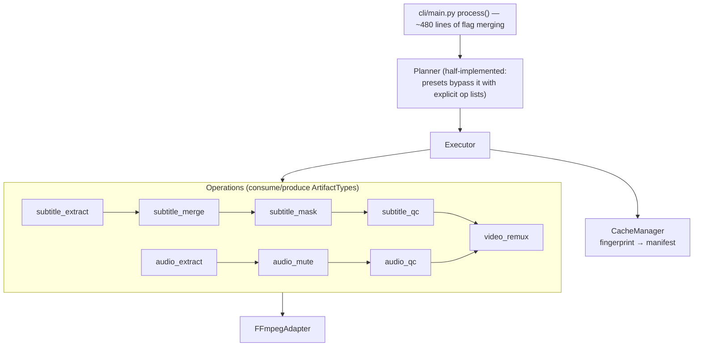

# Research: v1 Pipeline Internals — What to Keep, What to Discard

Assessment of the current processing pipeline for the v2 rebuild. Sources: `src/planner/*`, `src/ops/*`, `src/utils/fuzzy_matcher.py`, `src/caching/`, `src/adapters/ffmpeg.py`, `src/cli/main.py`.

## Current architecture

## Core detection mechanism (keep the concept)

**Profanity detection is subtitle-driven.** There is no audio transcription. `audio_mute._derive_mute_windows_from_subtitles()`:
1. Picks the best subtitle source (prefers the *original* pre-mask text when the masked one carries `original_file` metadata).
2. Runs `FuzzyMatcher` (rapidfuzz-based, window strategy, per-word thresholds, morphology-aware scoring, allowlist to suppress false positives like "damage" vs "damn") over each subtitle entry.
3. Emits a mute window per matched entry: `[entry.start − 0.2s, entry.end + 0.2s]`, then merges overlapping windows.
4. External mute-window JSON files can supplement/override (CLI `--mute-windows`).

Muting itself is FFmpeg `volume=0` filters over the windows (fixed in commit `652f4a4`). Subtitle masking replaces matched words with asterisks (partial masking keeps first letter, per `_mask_text_profanity`).

**Assessment**: subtitle-driven detection is the right default — cheap, deterministic, no ML dependency. The FuzzyMatcher itself (450 lines) is the most battle-tested logic in the repo (per-word thresholds, aggressive-mode toggles, allowlist) and its *semantics* should be ported deliberately, with its unit tests (`test_fuzzy_matcher.py`, `test_per_word_fuzzy.py`, `test_allowlist.py`) as the executable spec. The gap: mute windows cover the *whole subtitle entry* (plus padding), muting entire sentences to kill one word. Word-level timing would need forced alignment or transcription (e.g., faster-whisper) — a possible v2 enhancement, not a default.

## QC operations (keep the concept)

- `subtitle_qc`: re-scans masked output for residual profanity; recent fixes (`61a13a2`, `b65b201`) taught it to skip already-masked (asterisk) entries.
- `audio_qc`: RMS energy comparison — muted windows must be ≥ N dB quieter than neighboring control windows (defaults −15 dB threshold, 1 s control; presets use −12 dB / 0.5 s and `continue_on_audio_qc_fail: true` because hard failures were too noisy).
- QC ops are "pass-through" artifacts with verdict metadata; `continue_on_*_fail` flags decide abort vs. warn.

**Assessment**: verifying the output is a genuinely good idea and rare in similar tools — keep. In v2 these should be *validators* returning structured reports, not pseudo-operations that re-emit artifacts.

## What's broken / fragile (discard or redesign)

1. **Planner is dead weight.** `Planner.plan()` has TODOs for dependency resolution and priority selection; presets bypass it entirely via `requested_operations`. `explain_plan()` contains copy-pasted code *inside its docstring* (planner.py:100–109). v2: a pipeline is just an ordered list of stages — no planning abstraction needed.
2. **Artifact routing by side channels.** Executor `_find_inputs` special-cases ops by name; remux hunts the filesystem for muted audio (`_find_muted_audio_in_output_dir` globbing `audio_mute/*/`); track identity via path substrings. Whole classes of recent bugs (`8963fac`, `ed128a4`) were metadata lost between cache and executor. v2: a typed `PipelineContext` passed stage-to-stage; no filesystem archaeology, no name-based dispatch.
3. **`cli/main.py process()` is ~480 lines of manual flag merging** — four-layer precedence (CLI > preset > config > default) implemented as ad-hoc `if` cascades per flag, with sentinel-value bugs (e.g. `output != "./output"` to detect "user set it"). v2: resolve precedence once, generically, in a config module; CLI passes only explicit values.
4. **`OperationFlags` is a 30-field god object** passed to every op, plus dynamic `flags.__dict__["_applied_audio_encode"]` / `_should_write_output` side-channels. v2: each stage takes its own small, typed params model.
5. **Dead code / bugs**: unreachable misplaced block in `video_remux._process_subtitle_artifacts` (lines 423–425, references undefined `output_path`); `Artifact(checksum=...)` passed to a model with no such field (silently dropped by pydantic).
6. **Caching is over-engineered for the actual use-case** (fingerprint keys incorporating selector dumps; manifest reconstruction with type inference from file extensions). Real need: resumability of a failed run and skip-if-already-processed. v2: simpler job-level idempotency (workdir per job + "output exists and matches" check) rather than per-op content-addressed caching. → *worth confirming with Josh.*

## What's genuinely good (keep)

- FFmpegAdapter shape: args-as-list (no shell), probe → typed `MediaInfo`/`TrackInfo`, heartbeat logging for long runs (`HEARTBEAT` lines, `CENSORR_NO_HEARTBEAT=1` for tests).
- Subtitle selection filters: language + title include/exclude (`sdh`, `hi`, `cc` excluded by default so the mask source is clean dialogue), forced-track awareness.
- Dry-run everywhere; force/skip-existing mutual exclusion.
- Exit-code contract (0 ok / 2 ignored / 3 permanent / else transient).
- Test suite breadth (60+ files, contract/integration/unit) — the *behavioral assertions* are a spec for v2 even where the implementation isn't.

## Dependency notes

Runtime deps are lean and all still appropriate: typer, pydantic v2, rapidfuzz, pysubs2, rich, PyYAML, gunicorn. FFmpeg is the only system dependency. v1's `subtitle_parser` hand-rolls SRT parsing while pysubs2 (already a dependency) does this robustly — v2 should use pysubs2 as the single subtitle I/O layer.
