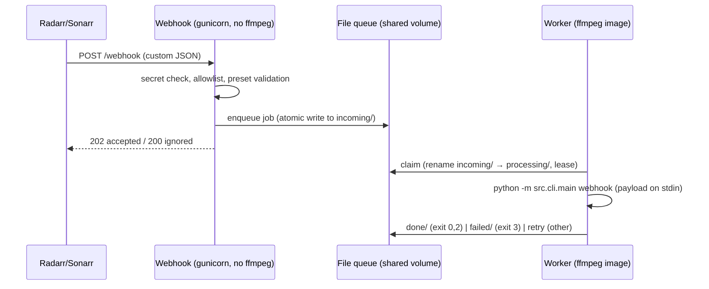

# Research: v1 Service Layer (Webhook, Queue, Worker) & Branch State

Sources: `src/webhook/wsgi_app.py`, `src/queue/file_queue.py`, `src/worker/runner.py`, `docker-compose.yml`, `docker-entrypoint.sh`, branch `feature/webhook-preset`.

## Current design



- **Two containers**: `censorr-webhook` (no FFmpeg, fast to start, port 8000) and `censorr-cli` worker (FFmpeg image). Shared queue volume.
- **File queue** (185 lines, zero deps): atomic `os.replace` moves through `incoming/ → processing/ → done|failed/`, lease-based crash recovery, bounded retries. Genuinely solid for single-host deployment.
- **Security**: optional `X-Webhook-Secret` header check, payload size cap, tag allowlist (`CENSORR_WEBHOOK_ALLOWLIST`, default requires `censorr_profile` tag), `webhooks_enabled` config kill-switch (branch adds preset validation + disable flag, commit `cbc8d0e`).
- **Observability**: structured JSON log lines with request_id; `/healthz`, `/status` with counters.

## Critical finding: the payload contract is custom, not native Arr

The webhook expects:
```json
{"source": "radarr", "eventType": "Download",
 "tags": {"censorr_preset": "movies"},
 "mediaPaths": ["/data/media/movies/.../Movie.mkv"]}
```

**Neither Sonarr nor Radarr sends this shape.** Native Arr webhooks send `eventType` + rich objects (`movie`, `movieFile.path`, `series`, `episodeFile.path`, …) and tags as an array of label strings — not a `{censorr_preset: ...}` dict (see arr-integration-contracts.md). So today, integrating requires either a Custom Script wrapper that reformats env vars into this JSON, or hand-rolled curl. The README's Custom Script example calls `docker exec` with `{{file_path}}` — also not a real Arr templating mechanism (Arr custom scripts pass env vars, not template args).

**Implication for v2**: the service should accept **native Sonarr/Radarr webhook payloads directly** (parse `eventType`, extract file paths from `movieFile`/`episodeFile`/`episodeFiles`), with preset selection via URL/query/config mapping rather than requiring the sender to inject custom tags. A generic endpoint can remain for manual/scripted invocation.

## Worker exit-code contract (keep)

| Exit | Meaning | Queue action |
|---|---|---|
| 0 | accepted/processed | done |
| 2 | ignored (unknown preset, no actionable paths) — not an error | done (ignored) |
| 3 | permanent validation failure | failed, no retry |
| other | transient | retry ≤ max_retries |

## Branch state: `feature/webhook-preset` (9 commits ahead of main, unmerged)

Working tree is clean; the branch contains the newest fixes — main does **not** have: track pruning, preset validation in webhook, audio mute FFmpeg filter fix, subtitle QC masked-entry handling, cache metadata preservation, muted-audio metadata tagging. The branch is effectively the current state of the art; v2 requirements should be derived from the branch, not main. Diff: ~2,490 insertions across 25 files (well past the repo's own 400-line PR gate — symptom of v1 architecture forcing sprawling fixes).

## Assessment for v2

Keep: two-process split (API without FFmpeg / worker with FFmpeg), file queue design, exit-code contract, structured logs + health endpoints, secret + size-cap + kill-switch hardening.

Redesign: native Arr payload parsing (primary), job status API (v1 has counters only — no per-job status endpoint; the queue's `done/`/`failed/` dirs contain the data but nothing serves it), and the worker should invoke the pipeline as a library call, not a subprocess re-entering the CLI (subprocess re-entry loses typed errors and doubles config loading).
